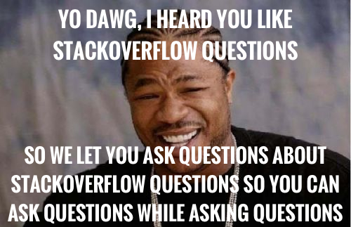

# Mongo II Lab: StackQuery
Topics:
  * Advanced nested schema
  * Schema types (Number, String, Boolean, ObjectId, Date, Buffer, Array)
  * Validation via mongoose
  * Relationships in MongoDB
  * Advanced Queries
    * Field equals
    * Multiple conditions
    * `$or` conditions
    * Array contains
    * `$in` conditions

## Description
This lab, StackQuery, is all about advanced queries. You'll be populating
MongoDB with JavaScript questions and answers from StackOverflow. Then you'll
query that dataset in various ways. In some sense, each query represents
a question that you could ask about the dataset. Hence, you're asking questions
about StackOverflow questions:



## Running the Project
- Run `npm install` to download the dependencies.
- Run `npm test` to run the tests. If you'd like, you can run `npm run watch`
  to automatically re-reun the tests when you make modifications.
- To test your application in your browser, or by using
  [Postman](https://www.getpostman.com/), make sure you've installed `nodemon`
  via `npm install -g nodemon` and then run `nodemon src/app.js`. `nodemon` will
  keep the server running and automatically restart it if you change anything.
  You can now make requests to `http://localhost:3000` in your browser or
  Postman!
- Make modifications to `src/populate.js` and `src/server.js` to make the tests
  pass.
- If you'd like, feel free to reference the tests in `tests/populate.test.js`
  and `tests/server.test.js` as you're developing.
- Once all tests have passed, you're done! Send us a pull request.

## Instructions
StackOverflow questions and answers are *both* represented as post objects. Here
are two example posts from from `posts.json`, your dataset of StackOverflow
posts. The first post is a question, whereas the second is an answer:

```js
// this is a question
{
  "soID": 503093,
  "parentID": null,
  "url": "https://stackoverflow.com/q/503093",
  "title": "How to redirect to another webpage in JavaScript/jQuery?",
  "body": "<p>How can I redirect the user from one page to another using JavaScript or jQuery?</p>\n",
  "score": 6868,
  "tags": [
    "javascript",
    "jquery",
    "redirect"
  ],
  "acceptedAnswerID": 506004,
  "user": {
    "soUserID": 44984,
    "name": "venkatachalam",
    "reputation": 43478
  }
}

// this is an answer to the above question
{
  "soID": 506004,
  "parentID": 503093,
  "url": "https://stackoverflow.com/q/506004",
  "title": null,
  "body": "<h2>One does not simply redirect using jQuery</h2>\n\n<p>jQuery is not necessary, and <strong><code>window.location.replace(...)</code></strong> will best simulate an HTTP redirect.  </p>\n\n<p><code>window.location.replace(...)</code> is better than using <code>window.location.href</code>, because <code>replace()</code> does not keep the originating page in the session history, meaning the user won't get stuck in a never-ending back-button fiasco.</p>\n\n<blockquote>\n  <p>If you want to simulate someone clicking on a link, use\n  <strong><code>location.href</code></strong></p>\n  \n  <p>If you want to simulate an HTTP redirect, use <strong><code>location.replace</code></strong></p>\n</blockquote>\n\n<p><strong>For example:</strong></p>\n\n<pre><code>// similar behavior as an HTTP redirect\nwindow.location.replace(\"http://stackoverflow.com\");\n\n// similar behavior as clicking on a link\nwindow.location.href = \"http://stackoverflow.com\";\n</code></pre>\n",
  "score": 11159,
  "tags": [

  ],
  "acceptedAnswerID": null,
  "user": {
    "soUserID": 8985,
    "name": "Ryan McGeary",
    "reputation": 156833
  }
}
```

`soID` stands for StackOverflow ID, and is the unique numeric identifier that
StackOverflow uses to discern its posts.

If the post's `parentID` field is `null`, that means the post is a question. By
contrast, if `parentID` is *not* `null`, the post is an answer. For an answer,
the `parentID` is the `soID` of the question that the post is answering.

### Post Model
Start by editing `src/post.js`. Based on the posts given above, and the
`posts.json` file if you need more examples, fill in the `PostSchema`. Fields
`soID`, `url`, `body`, and `score` are required; all other fields are optional.
Note that `tags` is an array of *strings* and `user` is a *nested object*; make
sure you represent their schemas appropriately. Every field that is an id should
be represented as a `Number`, not as an `ObjectId`, since these are not MongoDB
references, but rather StackOverflow numeric identifiers.

### Populate Posts
Now that you have a schema in place, populate MongoDB by adding all the posts in
`posts.json`. To do this, fill in the function `populatePosts()` in
`src/populate.js`. `populatePosts()` should read the posts array by calling
`readPosts()`, which we've given to you. Then, it should save each post to the
database. `populatePosts()` should return *a promise* that resolves only when
*all posts have successfully been added to the database*.

Hints:
- Calling `.save()` on a Post model without any arguments will return a promise
  that resolves once that post is saved.
- `Promise.all()` will come in handy here.

After you write this function, make sure the `populatePosts() populates all
posts` test passes (see `tests/populate.test.js`).

### `GET /accepted-answer/:soID`
In `src/server.js`, add a route handler for `GET /accepted-answer/:soID`. When
the client makes a `GET` request to `/accepted-answer/:soID`:

1. Find the question with the given soID (1 query).
2. Find the accepted answer of the question by using the `acceptedAnswerID`
   field (1 query).
3. Send back a JSON response with the single accepted answer post object.

You should *only* use 2 queries, and no more, for this route. If there's any
error, or if there is no accepted answer, report it with an appropriate message
and status code.

### `GET /top-answer/:soID`
When the client makes a `GET` request to `/top-answer/:soID`:

1. Find the question with the given soID (1 query).
2. Find the answer of the given question that has the *highest* score and *is
   not the accepted answer* (1 query).
3. Send back a JSON response with the single top answer post object.

You should *only* use 2 queries, and no more, for this route. If there's any
error, or if there is no top answer, report it with an appropriate message
and status code.

### `GET /popular-jquery-questions`
When the client makes a `GET` request to `/popular-jquery-questions`:

1. Find all question posts that are tagged with `jquery` and *either* have
   a score greater than 5000, or are posted by a user with reputation greater
   than 200,000 (1 query).
2. Send back a JSON response with an array of popular jquery questions.

You should *only* use 1 query, and no more, for this route. If there's any
error, report it with an appropriate message and status code.

### `GET /npm-answers`
When the client makes a `GET` request to `/npm-answers`:

1. Find all question posts that are tagged with `npm` (1 query).
2. Find all answers to all questions above (1 query).
3. Send back a JSON response with an array of answers to npm questions.

You should *only* use 2 queries, and no more, for this route. If there's any
error, report it with an appropriate message and status code.
